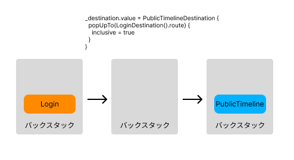

# [前の資料](./2_UI層実装.md)
# 導線実装
ログイン画面とパブリックタイムライン画面の導線実装を行います。  
アプリを起動した時の挙動を変更します。

## navigation-composeを使った画面遷移について

ログイン画面の導線実装に入る前に、まずJetpack Composeでの画面遷移の方法を学びましょう。こちらは説明用のコードなので、Yatterプロジェクトにはコピペしないでください。

Jetpack Composeでは画面遷移に[navigation-compose](https://developer.android.com/develop/ui/compose/navigation?hl=ja)を使うことが多いです。

`navigation-compose`で画面遷移を実現するには、まず`NavHost`の定義をして各画面ごとの画面遷移設定をする必要があります。

`NavHost`はComposable関数で、引数に`navController`,`startDestination`,`builder`を受け取ります。`startDestination`は初期状態で表示する画面のrouteです。navigation-composeでは、遷移先の情報であるrouteを文字列で扱います。

`NavHost`の`builder`ブロック内で各routeを定義します。`composable`メソッドの引数にroute名とそのrouteで表示するComposable関数を渡します。
引数を受け取りたい場合は、routeの宣言時にrouteをクエリパラメータの構文で指定します。受け取る際には、`backStackEntry.arguments`から取得します。

```kotlin
val navController = rememberNavController()
NavHost(
  navController = navController,
  startDestination = "Screen1"
) {
  composable("Screen1") {
    Screen1Page()
  }

  composable(
    "Screen2?arg1={arg1}&arg2={arg2}",
    arguments = listOf(
      navArgument("arg1") {
        defaultValue = "arg"
        type = NavType.StringType
      },
      navArgument("arg2") {
        nullable = true
        type = NavType.StringType
      },
    ),
  ) { backStackEntry ->
    val arg1 = requireNotNull(backStackEntry.arguments?.getString("arg1"))
    val arg2 = backStackEntry.arguments?.getString("arg2")
    Screen2Page(arg1, arg2)
  }
}
```

`navController.navigate`メソッドを呼び出すことで、実際に画面遷移を行います。

```kotlin
navController.navigate("Screen1")
```

引数付きで画面遷移を行いたい場合は、クエリパラメータの構文で引数を渡します。

```kotlin
navController.navigate("Screen2?arg1=foo&arg2=bar")
```

さて、`navigation-compose`の基本的な使い方を紹介しましたが、実際に使う上で少し問題点があります。それは、routeの定義や引数の受け渡しが文字列なため、画面遷移が型安全でないということです。

例えば、routeの引数の受け渡しの際に、文字列にするのと文字列から目的の形式に取り出すので、`navController.navigate`の呼び出し側と`NavHost`のroute定義側でそれぞれ引数の操作が必要です。

それを解決するために、今回は`Destination`型を定義して、画面遷移を型安全に実装できるようにしてあります。

```kotlin
abstract class Destination(
  val route: String,
  val builder: (NavOptionsBuilder.() -> Unit)? = null,
) {
  open fun buildRoute(): String = route
  open fun navigate(navController: NavController) {
    navController.navigate(buildRoute(), builder?.let { navOptions(it) })
  }
}
```

これをrouteごとに継承します。

```kotlin
class Screen1Destination : Destination(ROUTE) {
  companion object {
    private const val ROUTE = "Screen1"

    fun createNode(builder: NavGraphBuilder) {
      builder.composable(ROUTE) {
        Screen1Page()
      }
    }
  }
}
```

```kotlin
class Screen2Destination(
  private val arg1: String?,
  private val arg2: String?,
) : Destination(ROUTE) {
  override fun buildRoute(): String {
    return buildString {
      append(ROUTE_PATH)
      if (arg1 != null) {
        append("?$KEY_ARG1=$arg1")
      }
      if (arg2 != null) {
        append("?$KEY_ARG2=$arg2")
      }
    }
  }

  companion object {
    private const val ROUTE_PATH = "Screen2"
    private const val KEY_ARG1 = "arg1"
    private const val KEY_ARG2 = "arg2"
    private const val ROUTE = "$ROUTE_PATH?$KEY_ARG1={$KEY_ARG1}&$KEY_ARG2={$KEY_ARG2}"

    fun createNode(builder: NavGraphBuilder) {
      builder.composable(
        route = ROUTE,
        arguments = listOf(
          navArgument(KEY_ARG1) {
            defaultValue = "arg"
            type = NavType.StringType
          },
          navArgument(KEY_ARG2) {
            nullable = true
            type = NavType.StringType
          },
        ),
      ) { backStackEntry ->
        val arg1 = requireNotNull(backStackEntry.arguments?.getString(KEY_ARG1))
        val arg2 = backStackEntry.arguments?.getString(KEY_ARG2)
        Screen2Page(arg1, arg2)
      }
    }
  }
}
```

`companion object`に、`NavHost`にrouteの定義をするための`createNode`メソッドを実装することで、routeの定義と画面遷移の実装を`Destination`クラスに集約させることができました。

今回定義した`Destination`を使うと、`NavHost`のroute定義は以下のようになります。

```kotlin
val navController = rememberNavController()
val startDestination = Screen1Destination()
NavHost(
  navController = navController,
  startDestination = startDestination.route,
) {
  Screen1Destination.createNode(this)
  Screen2Destination.createNode(this)
}
```

画面遷移するときは、`navigate`メソッドに`navController`を渡します。

```kotlin
val screen1Destination = Screen1Destination()
screen1Destination.navigate(navController)
```

引数がある場合は、`Destination`クラスのインスタンス化時に渡します。

```kotlin
val screen2Destination = Screen2Destination(
  arg1 = "foo",
  arg2 = "bar",
)
screen2Destination.navigate(navController)
```

これで、navigation-composeを使いつつ型安全に画面遷移を実装することができます。

## パブリックタイムライン/ログインの導線実装

さて、Yatterアプリの実装に戻りましょう。

Yatterアプリで既にログインしていればアプリ起動時にはそのままパブリックタイムライン画面に遷移し、一度もログインしていなければログイン画面に遷移するような挙動にします。

※次の説明に登場する以下クラスは今回は既に用意されているため、目を通して理解するだけでOKです。
```
・CheckLoginService.kt
・CheckLoginServiceImpl.kt
・CheckLoginServiceImplSpec.kt
```

---

ログイン済みかどうかを判定するために`CheckLoginService`を新規作成し、`MainViewModel`でログイン状況を確認して遷移する画面を制御します。  

`CheckLoginService`の実装です。  
`CheckLoginService`はDomainServiceにあたるため、`domain/service`パッケージにinterfaceを定義し`infra/domain/service`に実装クラスを配置します。  

```Kotlin
// domain/service/CheckLoginService.kt

interface CheckLoginService {
  suspend fun execute(): Boolean
}
```

`CheckLoginServiceImpl`クラスの実装です。  
今回は認証情報がPreferencesに格納されているかどうかがログインを表していますのでそこを確認するように実装します。  

```Kotlin
// infra/domain/service/CheckLoginServiceImpl.kt

class CheckLoginServiceImpl(
  private val tokenPreferences: TokenPreferences,
) : CheckLoginService {
  override suspend fun execute(): Boolean {
    return tokenPreferences.getAccessToken().isNullOrEmpty().not()
  }
}
```

`CheckLoginServiceImpl`の実装が完了したら単体テストを書いてみましょう。  
今回のテストでは次の観点の確認ができると良さそうです。  

- TokenPreferencesに値が保存されていなければfalse
- TokenPreferencesに値が保存されていればtrue

<details>
<summary>CheckLoginServiceImplのテスト実装例</summary>

```Kotlin
class CheckLoginServiceImplSpec {
  private val tokenPreferences = mockk<TokenPreferences>()
  private val subject = CheckLoginServiceImpl(tokenPreferences)

  @Test
  fun getTrueWhenSavedUsername() = runTest {
    val accessToken = "accessToken"

    coEvery {
      tokenPreferences.getAccessToken()
    } returns accessToken

    val result: Boolean = subject.execute()

    assertThat(result).isTrue()

    verify {
      tokenPreferences.getAccessToken()
    }
  }

  @Test
  fun getFalseWhenUnsavedUsername() = runTest {
    val accessToken = ""

    coEvery {
      tokenPreferences.getAccessToken()
    } returns accessToken

    val result: Boolean = subject.execute()

    assertThat(result).isFalse()

    verify {
      tokenPreferences.getAccessToken()
    }
  }
}
```

</details>

---

次に、UI層で画面遷移の実装をするため、パブリックタイムラインとログインの`Destination`をそれぞれ実装します。次のファイルを新規作成します。

- ui/timeline/PublicTimelineDestination
- ui/login/LoginDestination

まずは`PublicTimelineDestination`の実装です。

```kotlin
class PublicTimelineDestination(
  builder: (NavOptionsBuilder.() -> Unit)? = null,
) : Destination(ROUTE, builder) {
  companion object {
    private const val ROUTE = "publicTimeline"

    fun createNode(builder: NavGraphBuilder) {
      builder.composable(ROUTE) {
        PublicTimelinePage()
      }
    }
  }
}
```

次に、`LoginDestination`の実装です。

```kotlin
class LoginDestination : Destination(ROUTE) {
  companion object {
    private const val ROUTE = "login"

    fun createNode(builder: NavGraphBuilder) {
      builder.composable(ROUTE) {
        LoginPage()
      }
    }
  }
}
```

これらを使い、画面遷移を行います。

Destinationを実装したので、ログイン画面のUI層実装で保留にした画面遷移の実装を完成させましょう。`LoginViewModel`の`onClickLogin`でログインが成功した際に`_destination`のStateFlowを`PublicTimelineDestination`で更新します。

```kotlin
fun onClickLogin() {
  viewModelScope.launch {
    _uiState.update { it.copy(isLoading = true) }
    val snapBindingModel = uiState.value.loginBindingModel
    when (
      val result =
        loginUseCase.execute(
          Username(snapBindingModel.username),
          Password(snapBindingModel.password),
        )
    ) {
      is LoginUseCaseResult.Success -> {
        // 追加
        _destination.value = PublicTimelineDestination()
      }
      is LoginUseCaseResult.Failure -> {
        // エラー表示
      }
    }
    _uiState.update { it.copy(isLoading = true) }
  }
}
```

<details>
<summary>おまけ: 戻るボタンでログイン画面に戻らないようにする</summary>
上記の実装だと、ログイン後に戻るボタンでログイン画面に戻ることができてしまいます。
popUpToを指定することによって、引数に指定したrouteに到達するまでNavControllerのバックスタックからroute取り出します。inclusive=trueを設定すると、指定したrouteも含めてバックスタックから取り出されるため、LoginDestinationのrouteがNavControllerのバックスタックから取り出されてなくなった状態でPublicTimelineDestinationのrouteがバックスタックに積まれるため、ログイン画面に戻ることを防ぐことができます。

```kotlin
_destination.value = PublicTimelineDestination {
  popUpTo(LoginDestination().route) {
    inclusive = true
  }
}
```



</details>

画面遷移が完了した後に`_destination`の値をクリアするために、`onCompleteNavigation`も実装します。

```kotlin
fun onCompleteNavigation() {
  _destination.value = null
}
```

`LoginViewModel`を修正したら、`destination`のStateFlowを`LoginPage`側で購読しましょう。
LocalNavControllerがエラーになると思いますが、この先の実装で解決するので今はこのままで大丈夫です。

```
val destination by viewModel.destination.collectAsStateWithLifecycle()
val navController = LocalNavController.current
LaunchedEffect(destination)  {
  destination?.let {
    it.navigate(navController)
    viewModel.onCompleteNavigation()
  }
}
```

これで、ログイン画面からパブリックタイムライン画面への画面遷移が実装できました。

---

続いて、アプリ起動時にログイン状態のチェックをして初期画面を決定するためのViewModelの実装を行います。  

`ui`パッケージに`MainViewModel.kt`ファイルを作成して、`MainViewModel`を定義します。  

```Kotlin
class MainViewModel : ViewModel()
```

`MainViewModel`ではログイン状況を確認するために引数に`CheckLoginService`を受け取ります。  

```Kotlin
class MainViewModel(
  private val checkLoginService: CheckLoginService,
) : ViewModel()
```

初期画面をUIに通知するための`Destination`を受け取る`StateFlow`の値を定義します。

```Kotlin
private val _startDestination = MutableStateFlow<Destination?>(null)
val startDestination: StateFlow<Destination?> = _startDestination.asStateFlow()
```

遷移用の値が作成できたため、画面初期化(`onCreate`)時にログイン状況を確認して遷移用の値を流します。  

```Kotlin
class MainViewModel(...) : ViewModel() {
  ...

  fun onCreate() {
    viewModelScope.launch {
      if (checkLoginService.execute()) {
        _startDestination.value = PublicTimelineDestination()
      } else {
        _startDestination.value = LoginDestination()
      }
    }
  }
}
```

`MainViewModel`のテストも書いてみましょう。    
`MainViewModel`のテストは次の観点で確認します。  

- ログイン済みであれば、パブリックタイムライン画面への遷移
- ログイン済みでなければ、ログイン画面への遷移

<details>
<summary>MainViewModelのテスト実装例</summary>

```Kotlin
class MainViewModelSpec {
  private val checkLoginService = mockk<CheckLoginService>()
  private val subject = MainViewModel(checkLoginService)

  @get:Rule
  val mainDispatcherRule = MainDispatcherRule()

  @get:Rule
  val rule: TestRule = InstantTaskExecutorRule()

  @Test
  fun navigateToPublicTimelineWhenLoggedIn() = runTest {
    coEvery {
      checkLoginService.execute()
    } returns true

    subject.onCreate()

    assertThat(subject.startDestination.value).isInstanceOf(PublicTimelineDestination::class.java)
  }

  @Test
  fun navigateToLoginWhenNotLoggedIn() = runTest {
    coEvery {
      checkLoginService.execute()
    } returns false

    subject.onCreate()

    assertThat(subject.startDestination.value).isInstanceOf(LoginDestination::class.java)
  }
}
```

</details>

---

次に、`NavHost`で各Pageへの画面遷移を管理するためのComposable関数を`MainApp`として定義します。
`ui`パッケージ以下に`MainApp.kt`ファイルを作成し、以下を実装します。

```kotlin
val LocalNavController = compositionLocalOf<NavController> {
  error("Not set a NavController!")
}

@Composable
fun MainApp(
  viewModel: MainViewModel = getViewModel(),
) {
  val navController = rememberNavController()
  val startDestination = viewModel.startDestination.collectAsState(initial = null).value
  LifecycleEventEffect(
    event = Lifecycle.Event.ON_CREATE,
  ) {
    viewModel.onCreate()
  }
  CompositionLocalProvider(
    LocalNavController provides navController,
  ) {
    if (startDestination != null) {
      NavHost(
        navController = navController,
        startDestination = startDestination.route
      ) {
        LoginDestination.createNode(this)
        PublicTimelineDestination.createNode(this)
      }
    }
  }
}
```

`CompositionLocal`という仕組みを使い、`NavController`を引数を経由せずに各Pageに渡しています。
`CompositionLocal`について、詳しく知りたい方は以下の公式ドキュメントを参照してください。

https://developer.android.com/develop/ui/compose/compositionlocal?authuser=1&hl=ja

`compositionLocalOf`で`CompositionLocal`を定義しています。命名は`Local〇〇`とするのが慣習です。

```kotlin
val LocalNavController = compositionLocalOf<NavController> {
  error("Not set a NavController!")
}
```

`CompositionLocalProvider`を使い、実際に`CompositionLocal`に対して値をセットします。
セットした値は、`CompositionLocalProvider`以下のComposable関数から使用することができます。

```kotlin
CompositionLocalProvider(
  LocalNavController provides navController,
) {
  // LocalNavController.current を呼び出すと、providesしたnavControllerを取得することができる
}
```

`MainViewModel`から初期画面の`Destination`を取得します。`CheckLoginService`の実行が終わるまではnullが、実行が終わったらログイン状態に応じた`Destination`が取得されます。

```kotlin
val startDestination = viewModel.startDestination.collectAsState(initial = null).value
```

`MainViewModel`は`onCreate()`でログイン状態の確認をします。`LifecycleEventEffect`を使い、`Lifecycle.Event.ON_CREATE`時に`viewModel.onCreate()`を呼び出すようにします。

```kotlin
LifecycleEventEffect(
  event = Lifecycle.Event.ON_CREATE,
) {
  viewModel.onCreate()
}
```

取得した`startDestination`を`NavHost`に渡し、初期画面とします。
また、ここで`NavHost`に各`Destination`を登録します。

```kotlin
CompositionLocalProvider(
  LocalNavController provides navController,
) {
  if (startDestination != null) {
    NavHost(
      navController = navController,
      startDestination = startDestination.route
    ) {
      LoginDestination.createNode(this)
      PublicTimelineDestination.createNode(this)
    }
  }
}
```

---

`MainApp`を実装したら、`MainActivity`と繋ぎこみます。
今まで直接Pageのコンポーネントを呼び出していた箇所を、`MainApp`コンポーネントを呼び出すようにします。

```kotlin
class MainActivity : AppCompatActivity() {

  override fun onCreate(savedInstanceState: Bundle?) {
    super.onCreate(savedInstanceState)
    setContent {
      Yatter2024Theme {
        MainApp()
      }
    }
  }
}
```

---

実装できたらDIの設定も忘れずに行います。  
今回は、`CheckLoginService`と`MainViewModel`を追加したので`domainImplModule`と`viewModelModule`に追記します。  

追記できたら実際に動かしてみましょう。  
実行時にエラーになる場合は記述の仕方を見直してみたりコード例と比較してみながら原因を探してみてくだい。  

<details>
<summary>DIコード例</summary>

```Kotlin
// DomainImplModule.kt
internal val domainImplModule = module {
  ...
  factory<CheckLoginService> { CheckLoginServiceImpl(get()) }
}

// ViewModelModule.kt
internal val viewModelModule = module {
  viewModel { MainViewModel(get()) }
}
```

</details>


これらの実装によりログイン状況に応じてアプリ起動時に表示される画面を分岐することができました。  
エミュレータで実際にYatterアプリを実装してみて動作を確認してみてください。  
一度ログインした後に再度ログイン画面を表示させたいときはアプリを再インストールすることでログイン画面から再度動作を確認できます。  

# [Appendixへ](./appendix/1_domain層実装.md)
# [次の章へ](../4.ツイート/1_ツイート機能概要.md)
