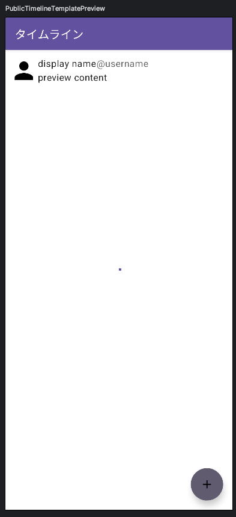

# [前の資料](./2_UI層実装.md)
# ツイート画面への導線実装
ツイート画面への導線を実装します。  
今回実装する導線は、パブリックタイムライン画面に`FloatingActionButton`を設置して、それが押されたらツイート画面が起動するようにします。  

## FloatingActionButtonとは
`FloatingActionButton`（通称：FAB）はAndroidアプリによくある画面右下に浮いているボタンのことを指しています。  
その画面におけるメインの操作をトリガーするためによく用いられ、Yatterにおいても投稿するという操作がメインに当たると考えられるので`FAB`でツイート画面が起動するようにします。  



## PostDestinationの実装とNavHostへの追加
FABを画面に追加する前に、まずはパブリックタイムライン画面からツイート画面へ遷移するための`PostDestination`を実装します。

```kotlin
class PostDestination : Destination(ROUTE) {
  companion object {
    private const val ROUTE = "post"

    fun createNode(builder: NavGraphBuilder) {
      builder.composable(ROUTE) {
        PostPage()
      }
    }
  }
}
```

実装した`PostDestination`を`MainApp`の`NavHost`に追加します。

```kotlin
@Composable
fun MainApp(
  viewModel: MainViewModel = getViewModel(),
) {
  ...
      NavHost(
        navController = navController,
        startDestination = startDestination.route
      ) {
        LoginDestination.createNode(this)
        PublicTimelineDestination.createNode(this)
        PostDestination.createNode(this) // 追加
      }
  ...
}
```

## パブリックタイムライン画面への追加実装
次に、FABが押されたときのイベント処理・遷移処理を行うために`PublicTimelineViewModel`の実装を行います。  

FABが押されたことを処理するメソッドを定義し、`_destination`に遷移用の値を流します。  

```Kotlin
class PublicTimelineViewModel(...) {
  ...
  fun onClickPost() {
    _destination.value = PostDestination()
  }
  ...
```

遷移が完了したあとに`destination`をクリアする処理も実装します。

```kotlin
class PublicTimelineViewModel(...) {
  ...
  fun onCompleteNavigation() {
    _destination.value = null
  }
  ...
```

ViewModel側への実装を行った後は、`PublicTimelinePage`で`destination`を取得してツイート画面へ遷移できるようにします。  

```Kotlin
fun PublicTimelinePage(...) {
  ...
  val destination by viewModel.destination.collectAsStateWithLifecycle()
  val navController = LocalNavController.current
  LaunchedEffect(destination) {
    destination?.let {
      it.navigate(navController)
      viewModel.onCompleteNavigation()
    }
  }
  ...
```

ここまでで遷移するための準備ができたのでCompose側の実装でFABを配置・動作するようにします。  
`PublicTimelineTemplate`を開き、FABが押された時の関数オブジェクト引数を追加します。  


```Kotlin
@Composable
fun PublicTimelineTemplate(
  ...
  onClickPost: () -> Unit, // 追加分
  ...
) {...}
```

Templateに引数を追加したことでプレビューでエラーが発生するようになったと思います。  
該当する引数をプレビュー側にも追加してあげましょう。  

```Kotlin
@Preview
@Composable
fun PublicTimelineTemplatePreview() {
  Yatter2024Theme {
    Surface {
      PublicTimelineTemplate(
        ...
        onClickPost = {}, // 追加分
        ...
      )
    }
  }
}
```

引数の準備もできたため、FABを実際に配置します。  
FABを実装するには`Scaffold`コンポーザブルの`floatingActionButton`引数に`FloatingActionButton`コンポーザブルを渡して表示させます。  
`Scaffold`の引数に渡すだけでFABを適した場所へ配置してくれます。  

```Kotlin
@Composable
fun PublicTimelineTemplate(...) {
  Scaffold(
    ...
    floatingActionButton = {
      FloatingActionButton(onClick = onClickPost) {
        Icon(
          imageVector = Icons.Default.Add,
          contentDescription = "post"
        )
      }
    },
  )
}

```

この状態でプレビューを確認すると画面右下にFABが表示されているはずです。  
今回は「+」のアイコンを表示するだけにしていますが、`Icon`コンポーザブルを`Image`コンポーザブルに置き換えて好きな画像にすることもできますので興味がある方は調べてやってみてください。  

`PublicTimelineTemplate`の実装が終わったため、呼び出している`PublicTimelinePage`でもTemplate呼び出し時の引数を追加してあげます。 

```Kotlin
@Composable
fun PublicTimelinePage(
  viewModel: PublicTimelineViewModel,
) {
  val uiState by viewModel.uiState.collectAsStateWithLifecycle()
  PublicTimelineTemplate(
    ...
    onClickPost = viewModel::onClickPost, // 追加分
    ...
  )
}
```

ここまでの実装を行った後はアプリを再度実行するとパブリックタイムライン画面にFABが表示され、押下するとツイート画面に遷移できるようになったはずです。  
ツイート画面では実際にStatusを投稿できるようになっており、投稿すると自動でパブリックタイムライン画面に戻り投稿したStatusが表示されるようになっているはずです。(自動更新されていない人は、PullToRefreshを試してください)  
動作を確認してみましょう。  

# [Appendix](./appendix/1_domain層実装.md)
# [次の章へ](../5.その次は/1_その次は.md)